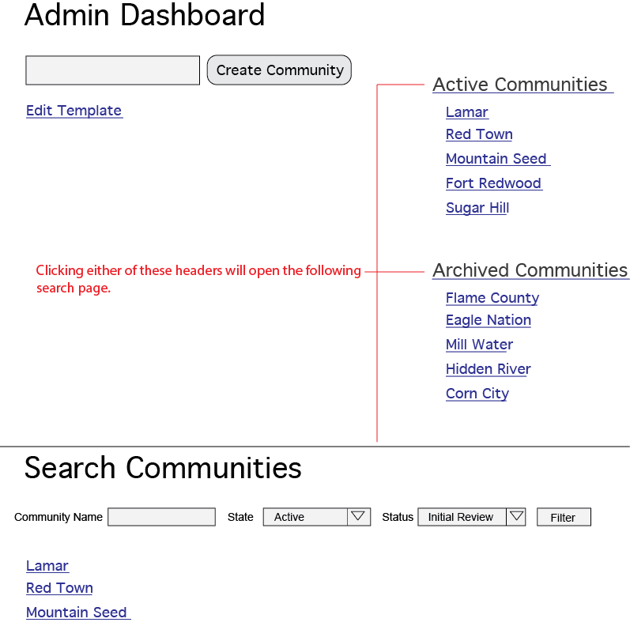
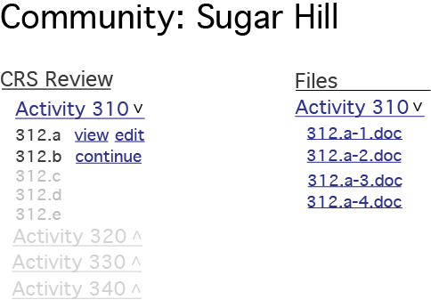

# CRS Cycle Verification Process
This will highlight some key features for the CRS verification process demo using the [Drupal CMS](https://www.drupal.org).
## Administrator Dashboard
The administrator dashboard will consist of the main functions necessary to create new communities, edit the template for the communities, view current or archived communities. A rough wireframe below with further descriptions of each section to follow.  
* * *

* * *
- **Create Community**  
This is a field that you will put in the community's name and hit the 'create community' button and from there create a role, category, and the nodes (content) for that community will be generated. The role can be given to a member of that community which will give them access to their own dashboard and give them the ability to edit all of the nodes created earlier. This will force the correct order as specified in the template.
- **Edit Template**  
This will either be a custom form or preferably a spreadsheet that will consist of the title of each section and which group of form elements to enable in each node. This basically will be an outline for what is created for each community. I'm hopeful this approach will help in the future to easily change things without creating problems for archived content. This should also make re-ordering or creation of any new steps much easier.
- **Current/Archived Communities**  
Two lists consisting of both Current and Archived communities with the most recent 10 (or so) will be listed on the right. Clicking on the titles will take you to a page that lists out all of the communities with a search section that allows you to type the name (or part of the name), select the state (pre-selected by which title you clicked: archived or active), and the status (actively inputting, initial review, ISO review, etc). From there you can use this filter to quickly find a community. Clicking on a community can take you to that communities dashboard.

## Community Dashboard
Rough wireframe below with further detail to follow.  
* * *

* * *
- **CRS Review**  
The community dashboard will consist of a list of activities to be filled out separated by main activity. The last filled out activity will be dropped down while all other activities will be collapsed. Main activities that are ahead of what the user has filled out will be greyed out and won't be expandable, while any activities behind the user's point can be expanded or collapsed. Any sub-activity that is ahead of the user's position will also be greyed out with no ability to view or edit. Though any sub-activity that is behind their current position can be viewed or edited.
- **Files Uploaded**  
All files that have been uploaded will be viewable here. Files will be listed by the parent activity. File names will be automatically changed into the correct format once uploaded.

## Activity forms
This part likely will take some tweaking as we go to make these work proficiently. Currently, I'm envisioning creating different content types per parent activity. Each content type will have the form elements for the user to fill out broken down into groups for each sub-activity (or question). When an admin hits the 'create community' button a piece of content will be created and ordered correctly for each question. A category will be set, which will make it so only a person belonging to that community can edit that form going forward. The proper title and order (which form comes before and after) will also be set, along with a checkbox to enable the group to show for each question. All of these administrator functions will be done via the template for each new community. Once a user from the community is given a role and username they can log in and start filling out the forms created for them, which is basically editing these content types. All of the administrator fields and unused groups will be hidden and only visible to administrators.

## Microsoft OneDrive
I wasn't able to find a great solution to use with Drupal for sending files to onedrive. After a little research I found [onedrive for linux](http://skilion.github.io/onedrive). Onedrive for linux would be installed on the server running your website and would sync the proper directory that holds all of the community files.
